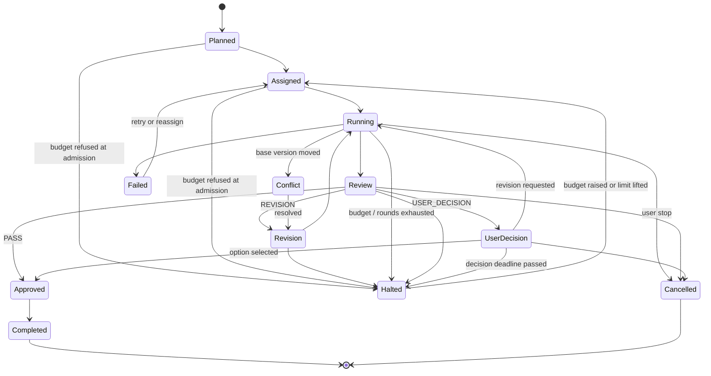

# ModelRoom — Spec v1.1 (Implementability Delta)

Status: implementation baseline. Supersedes the marked sections of v1.0.
This document only contains the parts of v1.0 that could not be built as written.
Everything not mentioned here is unchanged.

All money is stored as `BIGINT` micro-USD (1 USD = 1_000_000). Never floats, never
`NUMERIC` in hot paths. All token counts are integers.

---

## D1. Budget enforcement — reservation ledger (replaces §15.1)

**Problem in v1.0.** A hard stop at 100% of budget is impossible when cost is only
known from the `usage` event after a run completes. One streaming call can overshoot
an empty budget by its entire output length.

**Mechanism.** Two-phase accounting on an append-only ledger. A run may not start
until its *worst-case* cost is reserved.

```
CostLedgerEntry.type ∈ { HOLD, SETTLE, RELEASE }

available(project) = budgetLimitMicros
                  - SUM(HOLD where not yet settled/released)
                  - SUM(SETTLE)
```

### Admission

```ts
// Single SERIALIZABLE transaction. Returns the token cap the run must enforce.
async function admit(runReq: RunRequest, tx: Tx): Promise<TokenCap> {
  const cfg = await tx.modelConfig.findUnique({ where: { id: runReq.modelConfigId } });
  const inputTokens = await estimateInputTokens(runReq.contextPackage, cfg);

  const fixedCost   = inputTokens * cfg.inputPriceMicrosPerToken;
  const perOutTok   = cfg.outputPriceMicrosPerToken;
  const avail       = await availableMicros(runReq.projectId, tx);

  if (avail <= fixedCost + MIN_OUTPUT_TOKENS * perOutTok) {
    await haltProject(runReq.projectId, 'BUDGET_EXHAUSTED', tx);
    throw new BudgetExhausted();          // no Run row, no provider call
  }

  // Output cap is derived from REMAINING budget, not from static config.
  const affordableOut = Math.floor((avail - fixedCost) / perOutTok);
  const maxOutputTokens = Math.min(cfg.maxOutputTokens, runReq.maxOutputTokens, affordableOut);

  const holdMicros = fixedCost + maxOutputTokens * perOutTok;
  await tx.costLedgerEntry.create({
    data: { type: 'HOLD', runId: runReq.runId, projectId: runReq.projectId,
            amountMicros: holdMicros },
  });
  return { maxOutputTokens, holdMicros, inputTokens };
}
```

`MIN_OUTPUT_TOKENS = 512`. Below that a run cannot produce a usable deliverable, so
refusing is cheaper than half-generating one.

### Settlement

On any terminal outcome, in one transaction keyed by `runId` (idempotent — safe to
call twice):

| Outcome | Ledger writes |
|---|---|
| `completed` | `SETTLE actual`, `RELEASE hold - actual` |
| `failed` / `cancelled`, usage reported | `SETTLE partial`, `RELEASE remainder` |
| `failed` before provider accepted | `RELEASE hold` |
| `failed`, no usage event, no output produced | `RELEASE hold` — an explicit failure with nothing generated means no tokens were processed |
| `failed` / `cancelled`, no usage event, output produced | `SETTLE` input estimate + streamed output, `RELEASE` remainder |
| unreconcilable (see D2) | `SETTLE hold` (assume worst case), flag `AuditEvent` |

The last row matters: an unknown outcome must be settled pessimistically, because the
provider may already have charged. Releasing an unknown hold is how you build a
budget that leaks money.

### Streaming guard (defence in depth)

`max_output_tokens` is passed to the provider, but the worker also counts streamed
output tokens and calls `adapter.cancel(runId)` at `maxOutputTokens`. Providers
occasionally exceed caps on tool-call paths; the ledger must not depend on their
compliance.

### Alerts

Thresholds fire on `(SETTLE + active HOLD) / budgetLimit` — i.e. reserved money
counts as spent for alerting. Each threshold emits at most once per project
(`Project.alertsFired` bitmask), so an alert can't spam on every run.

---

## D2. Idempotency (replaces §16 final paragraph)

**Two independent problems.** Duplicate HTTP requests, and provider calls whose
outcome is unknown.

### Request-level

`IdempotencyKey(scope, key)` unique. Client supplies `Idempotency-Key` on `POST
/projects/:id/run`, `/tasks/:id/retry`, `/tasks/:id/review`, `/tasks/:id/decision`.
Stores `requestHash`; a replay with the same key but different body → `409`. A replay
with the same body returns the stored response snapshot.

### Provider-level — the expensive case

The dangerous sequence: we call the provider, it accepts and starts billing, the
socket dies before we persist anything. A naive retry double-charges.

```
1. TX: INSERT Run(status=PENDING, idempotencyKey, contextPackageId) + HOLD
2.     call provider
3.     on first event: UPDATE Run SET providerRequestId = <id>   -- unconditional, own TX
4. TX: SETTLE + Run.status = terminal
```

`UNIQUE(taskId, idempotencyKey)` on `Run`. Step 1 precedes any network call, so a
charge can never exist without a row. Step 3 is deliberately its own transaction and
runs before any content processing — the provider handle is the only thing that makes
step 5 possible.

### Reconciliation sweeper

Runs stuck in `PENDING` past `runTimeoutSec + grace`:

- `providerRequestId` present → fetch the run from the provider (Responses:
  `GET /v1/responses/{id}`; Interactions: retrieve the interaction) and settle actual usage.
- absent → the request may still have landed. Mark `Run.status = UNKNOWN`, settle the
  full hold, write an `AuditEvent`, and surface it in the §8.4 activity log. Do not
  auto-retry: reassignment is a user decision when we may have already paid.

### Retry semantics

A retry is a **new** `Run` with a **new** idempotency key, sharing
`attemptGroupId` with the original so the UI groups attempts and §19's "retry without
duplicate runs" is verifiable by asserting one non-`UNKNOWN` billed run per group.

---

## D3. State machine (replaces §7)

v1.0's diagram is missing states that v1.0 itself requires: `Conflict` (§14, §16),
plus terminations for user-stop and budget-exhausted (§7.1).



| State | Terminal | Holds artifact lease | Resumable |
|---|---|---|---|
| `Halted` | no | **no — lease released on entry** | yes |
| `Cancelled` | yes | no | no |
| `Conflict` | no | no | via resolution |
| `Unknown` (run-level only) | yes | no | user decision |

**`Halted` is reachable before `Running`.** Admission (D1) can refuse a run for
budget before any provider call exists, so `Planned` and `Assigned` both need an edge
to `Halted`. Omitting it leaves the task sitting in `Assigned` where a scheduler will
retry it forever against an exhausted budget. *(Found by the implementation tests, not
by review.)*

**`UserDecision` deadline.** `Task.decisionDeadlineAt` (default +72h). On expiry the
task moves to `Halted`, *not* to an auto-selected option — silently picking a model's
answer would corrupt the §19 decision history. Entering `Halted` releases the artifact
lease, which is the whole reason `Halted` exists as a distinct state from `Cancelled`.

**Transition guard.** One code path:

```ts
transition(taskId, from: TaskStatus[], to: TaskStatus, cause: Cause, tx)
// UPDATE task SET status=$to, version=version+1
//   WHERE id=$taskId AND status = ANY($from) AND version=$expected
// rowCount === 0  -> ConcurrentTransition, caller retries
// same TX: INSERT AuditEvent
```

No transition without an audit row in the same transaction. That is what makes §19's
traceability an invariant rather than a convention.

Project states: `Draft → Planning → PlanReview → Running → {Completed, HaltedBudget, Cancelled} → Archived`.

---

## D4. Artifact leases (replaces §14)

"Only one active writer" without expiry deadlocks the artifact when a worker dies.

```
ArtifactLease(artifactId PK, holderRunId, epoch, acquiredAt, expiresAt, heartbeatAt)
LEASE_TTL = 120s, HEARTBEAT = 30s
```

Acquire is a conditional upsert (`WHERE expiresAt < now()`), incrementing `epoch`.
`epoch` is a **fencing token**: every `ArtifactVersion` write carries the epoch it was
produced under, and writes with a stale epoch are rejected. A worker partitioned away
from the DB, whose lease was reclaimed, therefore cannot corrupt state when it comes
back.

Heartbeat failure → the worker cancels its own run rather than continuing to generate
output it can no longer commit. Reclaiming an expired lease writes an `AuditEvent`.

### Versioning and conflict

```
Artifact(id, headVersion, activeWriterRunId?)
ArtifactVersion(artifactId, version, baseVersion, uri, createdByRunId, epoch)
  UNIQUE(artifactId, version)
```

Save requires `baseVersion == headVersion`; otherwise the task enters `Conflict` and
both versions are exposed (§8.3 UI). No auto-merge, per v1.0.

**Reviewers never acquire a lease.** A review produces `ArtifactPatch(artifactId,
baseVersion, diff, proposedByRunId, status)`. Only the assignee applies patches, which
is what makes "the assigned model performs the final merge" enforceable at the schema
level instead of by prompt instruction.

---

## D5. Assignment score cold start (replaces §6.3)

`Historical Quality 20%` is undefined at launch with zero data. Fixed with Bayesian
shrinkage toward a configured prior:

```
score = 0.45·capability + 0.20·quality + 0.15·cost + 0.10·latency + 0.10·preference

quality(model, tag) = (approvals + m · prior(model, tag)) / (n + m)
  m = 10 (pseudo-count), n = completed runs for that (model, tag)
  prior = 0.70 if the §6.4 matrix names this model primary for the tag, else 0.50
```

At `n = 0` quality equals the prior, so the formula is total-ordered from the first
request and converges to observed rates without a discontinuity. `approvals` counts
tasks whose first review returned `PASS` **and** which the user did not later revise —
approval alone is too weak a signal.

- `capability`: `ModelConfig.capabilities[tag] ∈ [0,1]`, from config.
- `cost`: `1 - est_cost / max(est_cost across candidates)`.
- `latency`: `1 - p50_ms / max(p50_ms across candidates)`, rolling 100 runs, prior 1.0.
- `preference`: user pin = 1.0 for pinned model, 0 otherwise; 0.5/0.5 if unpinned.

**Forced cross-review** (v1.0 §6.1 step 5, now concrete): when
`score_top - score_second < 0.08`, or the task carries a tag in
`config.highRiskTags` (default: `fact_check`, `final_synthesis`, `coding`).

**`AssignmentDecision`** persists the full per-factor breakdown plus the chosen and
runner-up model. This is not optional — §20's "automatic assignment retention rate"
KPI is uncomputable without knowing what the engine originally proposed versus what
the user changed it to.

Add `image_generation` to §6.2's tag list; §9.2 requires it to be independently
routable, but v1.0's tag list only has `visual_direction`.

---

## D6. Review as a first-class entity (fills §17 / §11 gap)

v1.0 defines PASS / REVISION / USER_DECISION but has nowhere to store them —
`Decision` models only *user* choices.

```
Review(id, taskId, round, reviewerRunId, contextPackageId,
       verdict ∈ {PASS, REVISION, USER_DECISION, BLOCKED_SAFETY},
       confidence, createdAt)

ReviewCriterionResult(reviewId, criterionKey, passed BOOLEAN,
                      evidence TEXT,        -- must quote the deliverable
                      severity ∈ {INFO, MINOR, MAJOR, BLOCKER})
```

`ReviewCriterion` rows are seeded per task type from §15.2's quality gates, so a
verdict is the *aggregation* of a checklist rather than a free-form model opinion:
any `BLOCKER` → `USER_DECISION`; any `MAJOR` → `REVISION`; else `PASS`.

`BLOCKED_SAFETY` gives §16's safety-refusal row a persisted home.
`Decision` gains `reviewId` FK.

Self-reported `confidence` (§13) is **advisory only** — it is not comparable across
providers and must never gate a transition. It is stored for post-hoc calibration
analysis and displayed, nothing more.

---

## D7. ContextPackage as a persisted, versioned entity (extends §13)

Provider conversation state is per-provider and non-transferable: OpenAI Responses
state and Gemini Interactions state cannot be handed to each other. The Context
Package is therefore the *only* channel between the two models — which makes it the
single highest-value record for debugging and for the §8.4 activity log. Building it
transiently in memory would make cross-review non-reproducible.

```
ContextPackage(id, taskId, round, targetProvider, payload JSONB,
               tokenEstimate, contentHash, sourceRefs JSONB, createdAt)
Run.contextPackageId FK  -- exact replay of any historical call
```

`sourceRefs` pins exact inputs: `artifactVersionIds`, `decisionIds`, `reviewIds`,
`fileIds`. The builder is **deterministic** given those refs, so a replay reproduces a
byte-identical package; `contentHash` verifies it.

**Size budget.** The package must fit
`min(targetModel.contextLimit) - reservedOutputTokens - safetyMargin`. Files exceeding
`fileSummaryThresholdTokens` are replaced by summaries — and those summaries are
themselves stored as `Artifact`s of type `SUMMARY`, so what the reviewer actually saw
is auditable. An invisible lossy summarization step is the most likely root cause of
"the reviewer missed something obvious", and it must be inspectable.

Provider state is tracked separately, never merged:

```
ProviderThreadRef(threadId, provider, externalId, lastSyncAt)
  UNIQUE(threadId, provider)
```

---

## D8. Missing entities and endpoints (extends §11 / §12)

### New entities

| Entity | Why |
|---|---|
| `ModelConfig` | §9.2 mandates config-driven model IDs, pricing, capabilities, context limits — absent from §11 |
| `ProviderCredential` | BYOK (§21); envelope-encrypted via KMS, `ciphertext` never leaves the server, never returned by any endpoint |
| `WorkspaceMember` | §15.3 per-user authorization needs a membership edge; `Project.workspaceId` alone can't answer "may this user read this file" |
| `IdempotencyKey` | D2 |
| `CostLedgerEntry` | D1 |
| `Review`, `ReviewCriterionResult` | D6 |
| `ContextPackage` | D7 |
| `ArtifactVersion`, `ArtifactLease`, `ArtifactPatch` | D4 |
| `AssignmentDecision` | D5 / §20 KPI |
| `ProviderThreadRef` | D7 |
| `ProjectEvent` | SSE replay, below |

### New endpoints

| Method | Endpoint | Purpose |
|---|---|---|
| POST | `/projects/:id/plan/approve` | approve plan — distinct from `/run`, which v1.0 conflated |
| POST | `/projects/:id/stop` | §7.1 "user stops execution" had no endpoint |
| POST | `/runs/:id/cancel` | surfaces `ModelAdapter.cancel` |
| GET | `/projects/:id/artifacts` | §19 "reopen final artifacts" |
| GET | `/artifacts/:id/versions` | version history |
| POST | `/artifacts/:id/patches` | reviewer change proposals (D4) |
| POST | `/artifacts/:id/resolve-conflict` | exit `Conflict` |
| GET | `/tasks/:id/reviews` | cross-review trail |
| GET | `/projects/:id/estimate` | §15.1 pre-execution cost estimate |

### SSE resumability

`GET /projects/:id/events` must survive the reconnects that a 10-minute run
guarantees.

- `ProjectEvent(projectId, seq BIGSERIAL, type, payload, createdAt)`, monotonic per project.
- `id: <seq>` on every SSE frame; client reconnect sends `Last-Event-ID`; server
  replays `seq > n` from `ProjectEvent`.
- Comment heartbeat every 15s to defeat proxy idle timeouts.
- 24h retention, then prune. Beyond that the activity log endpoint is authoritative.

Without this, a dropped connection silently loses `text_delta`s and the user sees a
truncated deliverable that the database believes is complete.

---

## D9. MVP scope reduction (amends §4.1, §5, §18)

**Cut Debate and Competition from the MVP.** Ship Delegation + Review + Manual.

Rationale: v1.0 §7.1 already sets the default to one proposal, one cross-review, one
revision — so Debate and Competition add no new primitive, only multiplied round,
budget, and state surface, plus the §8.3 N-way comparison UI. The Review path exercises
the entire state machine, ledger, and lease design. Both modes reuse the same
Orchestrator and move to Phase 3.

This is what buys back the schedule risk in §18's 7-week single-developer estimate,
which does not account for the ledger, lease, sweeper, and SSE replay work above.

Revised Phase 2 exit criteria: §19 acceptance items 1–8 pass with `mode ∈
{delegation, review, manual}`.

---

## D10. Provider API notes (amends §22)

Both v1.0 references verified as current:

- Gemini **Interactions API** is Generally Available as of June 2026 and is the
  recommended surface for new work; `generateContent` is legacy but still supported.
  <https://ai.google.dev/gemini-api/docs/interactions-overview>
- OpenAI **Responses API** is recommended for all new projects.
  <https://developers.openai.com/api/docs/guides/migrate-to-responses>

**Not in v1.0, and load-bearing:** the OpenAI **Assistants API is being sunset on
2026-08-26**. Much of the surviving example code for multi-turn OpenAI agents targets
Assistants; none of it may be used as a template for the adapter in §10.
<https://developers.openai.com/api/docs/guides/migrate-to-responses>

Both providers now hold conversation state server-side, which reinforces D7: the
adapter stores an opaque `externalId` per provider and never attempts to translate one
provider's state into the other's.

*Source content was rephrased for compliance with licensing restrictions.*
